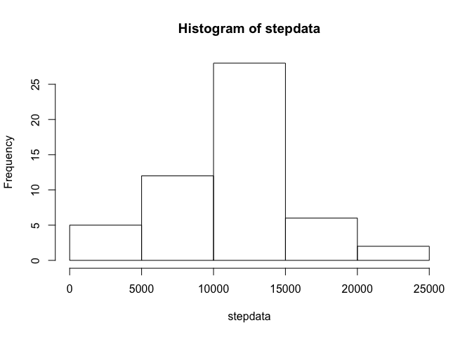
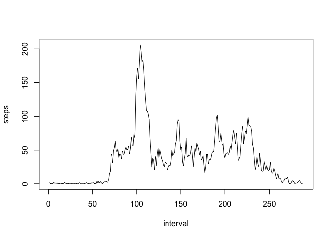
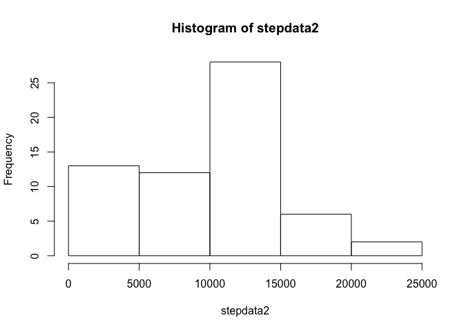
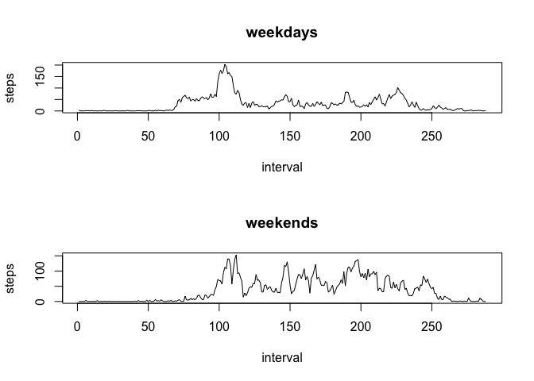

# Reproducible Research: Peer Assessment 1
Dengjiahao  
This paper is a course project for Coursera Data Science Specialization. It will use a provided [data](https://d396qusza40orc.cloudfront.net/repdata%2Fdata%2Factivity.zip) to demonstrate the following question:   
- Loading and preprocessing the data
- What is mean total number of steps taken per day?
- What is the average daily activity pattern?
- Imputing missing values
- Are there differences in activity patterns between weekdays and weekends?
   
So I will focus on these questions one by one.

##Loading and preprocessing the data

```r
unzip("activity.zip")
data<-read.csv("activity.csv")
head(data)
```

```
##   steps       date interval
## 1    NA 2012-10-01        0
## 2    NA 2012-10-01        5
## 3    NA 2012-10-01       10
## 4    NA 2012-10-01       15
## 5    NA 2012-10-01       20
## 6    NA 2012-10-01       25
```

##What is mean total number of steps taken per day?

```r
##First, calculate the total number of steps taken per day
date<-levels(data$date)
stepdata<-NA
for(i in 1:length(date)){
  stepdata[i]<-sum(data$steps[data$date==date[i]])
}
stepdata
```

```
##  [1]    NA   126 11352 12116 13294 15420 11015    NA 12811  9900 10304
## [12] 17382 12426 15098 10139 15084 13452 10056 11829 10395  8821 13460
## [23]  8918  8355  2492  6778 10119 11458  5018  9819 15414    NA 10600
## [34] 10571    NA 10439  8334 12883  3219    NA    NA 12608 10765  7336
## [45]    NA    41  5441 14339 15110  8841  4472 12787 20427 21194 14478
## [56] 11834 11162 13646 10183  7047    NA
```

```r
##Then Make a histogram of the total number of steps taken each day.
hist(stepdata)
```

 


```r
##Calculate and report the mean and median of the total number of steps taken per day
mean(stepdata,na.rm=TRUE)
```

```
## [1] 10766.19
```

```r
median(stepdata,na.rm=TRUE)
```

```
## [1] 10765
```

##What is the average daily activity pattern?

```r
interval<-data$interval[0:288]
stepsInterval<-NA
for(i in 1:length(interval)){
  stepsInterval[i]<-mean(data$step[data$interval==interval[i]],na.rm=TRUE)
}
#Make a time series plot
plot(stepsInterval,type="l",ylab="steps",xlab="interval")
```

 


```r
##Find out which 5-minute interval contains the maximum number of steps
which.max(stepsInterval)
```

```
## [1] 104
```

```r
interval[which.max(stepsInterval)]
```

```
## [1] 835
```

##Imputing missing values

```r
##Calculate the number of the missing value
sum(is.na(data$steps))
```

```
## [1] 2304
```

I will use the average in that interval to fill in that missing value.

```r
##create a new data set data2
data2<-data
for(i in 1:length(data2$steps)){
  if(is.na(data2$steps[i]))
    data2$steps[i]=stepsInterval[data2$interval[i]%%5+1]
}
head(data2)
```

```
##      steps       date interval
## 1 1.716981 2012-10-01        0
## 2 1.716981 2012-10-01        5
## 3 1.716981 2012-10-01       10
## 4 1.716981 2012-10-01       15
## 5 1.716981 2012-10-01       20
## 6 1.716981 2012-10-01       25
```

```r
## Make the histogram
date2<-levels(data2$date)
stepdata2<-NA
for(i in 1:length(date2)){
  stepdata2[i]<-sum(data2$steps[data2$date==date2[i]])
}
hist(stepdata2)
```

 

```r
##Find out the mean and median
mean(stepdata2,na.rm=TRUE)
```

```
## [1] 9419.081
```

```r
median(stepdata2,na.rm=TRUE)
```

```
## [1] 10395
```

```r
## And we can compare the before and after
mean(stepdata,na.rm=TRUE)
```

```
## [1] 10766.19
```

```r
median(stepdata,na.rm=TRUE)
```

```
## [1] 10765
```

##Are there differences in activity patterns between weekdays and weekends?

```r
weekdays<-weekdays(as.Date(data2$date))
data2<-data.frame(data2,weekdays)
data2$weekdays<-as.character(data2$weekdays)
for(i in 1:length(data2$weekdays)){
  if(data2$weekdays[i]=="Sunday"||data2$weekdays[i]=="Saturday")
    {data2$weekdays[i]="Weekends"}
  else
    {data2$weekdays[i]="Weekdays"}
}
```


```r
subdataWeekdays<-data2[data2$weekdays=="Weekdays",]
subdataWeekends<-data2[data2$weekdays=="Weekends",]
interval1<-subdataWeekdays$interval[0:288]
stepsInterval1<-NA
for(i in 1:length(interval1)){
  stepsInterval1[i]<-mean(subdataWeekdays$step[subdataWeekdays$interval==interval1[i]],na.rm=TRUE)
}
interval2<-subdataWeekends$interval[0:288]
stepsInterval2<-NA
for(i in 1:length(interval2)){
  stepsInterval2[i]<-mean(subdataWeekends$step[subdataWeekends$interval==interval2[i]],na.rm=TRUE)
}
par(mfrow=c(2,1))
plot(stepsInterval1,type="l",ylab="steps",main="weekdays",xlab="interval")
plot(stepsInterval2,type="l",ylab="steps",main="weekends",xlab="interval")
```

 

So I guess there is some difference.
